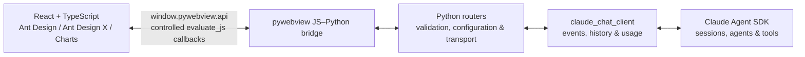

# Xalling

> Your Desktop, Reimagined with AI.

Xalling 是一个本地优先的 AI 桌面工作台：以 Python 管理业务与智能体，以 pywebview 承载 React 界面，并通过安全、直接的 JavaScript–Python 桥接完成交互。它不把本地 HTTP 服务当作前后端中间层。

## 功能特性

- **AI 对话工作区**：基于 Claude Agent SDK 的多会话对话，支持子 Agent、后台任务与动态工作流
- **统一事件协议**：实时流式输出与历史回放共用同一套事件归并逻辑，刷新或切换会话后结构不漂移
- **权限与交互**：工具调用确认、`AskUserQuestion` 结构化问答、计划审批（ExitPlanMode）
- **斜杠命令与 Skill**：输入框 `/` 唤起命令与技能列表，自动发现用户级与项目级 Skill 目录
- **定时自动化**：基于 APScheduler 的定时任务（interval / date / cron），任务持久化在 SQLite
- **联网搜索**：`WebSearchBaidu`、`WebSearchDuckDuckGo`、`WebSearchNews` 以 SDK 内置 MCP 工具注入每个会话，分别对接百度与 DDGS（DuckDuckGo 后端）的网页与新闻结果
- **科研工具**：`ArxivSearch`、`ArxivDownload` 以 SDK 内置 MCP 工具注入每个会话，支持 arXiv 论文检索与 PDF 下载（保存目录由 `download_dir` 工具参数指定）
- **模型站点管理**：多供应商模型配置，支持 `anthropic` / `chat` / `responses` 三种 API 协议
- **用量统计**：按逻辑回合统计主 Agent Token 与子 Agent 消耗，提供会话内用量弹层
- **会话历史与搜索**：会话列表、全文搜索、运行中会话恢复
- **多主题外观**：default / dark / cartoon / illustration / geek / serene / mui / glass 八套主题
- **本地教程**：内置命令说明等教程文档，在应用内直接查看

## 架构



所有业务数据都经 pywebview 的 JS–Python 桥传递；Python 服务不监听 localhost 端口，前端也不通过 `fetch`、Axios、WebSocket 或 SSE 调用本地后端。

## 技术栈

| 层级 | 选型 | 用途 |
| --- | --- | --- |
| 桌面容器 | [pywebview](https://pywebview.flowrl.com/) | 原生无边框窗口、加载本地 Web UI、JS–Python 桥 |
| 后端 | Python 3.12 + [uv](https://docs.astral.sh/uv/) | 领域逻辑、文件与系统能力、桥接 API、测试与依赖管理 |
| 基础 UI | [Ant Design](https://ant.design/components/overview-cn/) | 桌面布局、表单、数据展示、导航和反馈组件 |
| AI UI | [Ant Design X](https://x.ant.design/components/introduce-cn/) | 会话、消息气泡、输入、快捷提示、思考/任务状态等 AI 交互组件 |
| 图表 | [Ant Design Charts](https://charts.ant.design/) | 任务趋势、统计和分析视图；连续数据优先使用折线图 |
| 智能体 | [Claude Agent SDK](https://code.claude.com/docs/en/agent-sdk/python) | Python 智能体、会话、工具与任务循环 |
| 定时任务 | APScheduler + SQLAlchemy JobStore | 定时/周期任务调度与持久化 |
| 配置 | Pydantic Settings + Tomli-W | TOML 配置加载、类型校验与局部更新 |
| 打包 | PyInstaller + Inno Setup | Windows 目录分发与安装程序 |

## 模型配置

本地配置使用 TOML 数组；每个 `[[model]]` 是一级模型站点，每个 `[[model.models]]` 是该站点下的模型配置：

```toml
[[model]]
name = "内部部署 · 阿里云"
api_key = ""
api_url = "https://api.example.com"
# 可选值：anthropic、chat、responses；后两者会通过本地代理转换为 Anthropic Messages
api_protocol = "anthropic"

[[model.models]]
name = "Kimi-K2.6"

[[model.models]]
name = "Qwen3.6-35B-A3B"
```

- `api_protocol = "anthropic"`：供应商原生支持 Anthropic Messages 协议，直接连接。
- `api_protocol = "chat"` / `"responses"`：为每个 Claude 会话启动一个仅监听 `127.0.0.1` 的本地代理（`plugins/bin/claude-proxy-rust.exe`，源码见 Git 子模块 [`plugins/claude-proxy-rust`](https://github.com/luojiaaoo/claude-proxy-rust)），把 Anthropic Messages 请求转换为 OpenAI Chat Completions / Responses 接口。连接关闭后自动回收，API Key 不会写入项目文件。

`backend/config/setting.py` 中的 `Settings` 会把 `model` 加载为 `ModelSiteConfig` 列表，每个站点下的 `models` 则是 `ModelConfig` 列表。界面通过 pywebview 桥接获取分组名、模型名和上下文设置，并保存当前选择，不会接触 API Key 或 API URL。推理强度是对话界面的临时状态，不写入配置文件。

真实配置位于 `~/.xalling/xalling-setting.toml`；可从仓库根目录的 `setting.example.toml` 复制创建。示例文件不包含 API Key。

当前选择单独保存在 `~/.xalling/xalling-current.toml`：

```toml
[model]
site = "火山方舟"
name = "glm-5.3-flash"
```

`xalling-current.toml` 按功能分组，后续当前状态可以增加新的顶级分组。应用启动时会优先恢复 `[model]` 中的选择；文件不存在或所选模型已从 `xalling-setting.toml` 移除时，会自动选中并保存第一个可用模型。

### Skill 目录

Xalling 会把下列已存在的用户级 Skill 目录作为 Claude Agent SDK 本地插件加载：

- Xalling：`~/.xalling/skills/`
- OpenCode：`~/.config/opencode/skills/`
- Agent Skills / Codex：`~/.agents/skills/`
- 当前项目：`<project>/.agents/skills/`

每个 Skill 使用 `<目录>/<skill-name>/SKILL.md` 结构。不存在的目录会被忽略；目录内容的增删会在下一次 Agent 会话启动时重新发现。

## 对话系统

聊天能力由以下几层承担：

| 层级 | 职责 |
| --- | --- |
| `backend/claude_chat_client/` | 管理 Claude SDK 连接，将 SDK 消息转换为稳定事件，处理权限交互、动态工作流、历史回放和单回合用量 |
| `backend/service/claude_options.py` | 将模型、项目、推理强度、权限模式、Skill 目录和本地运行设置转换成 `ClaudeAgentOptions` |
| `backend/router/chat.py` | 校验界面参数，管理会话级客户端，通过 pywebview 桥发送事件并暴露会话 API |
| `frontend/src/bridge/client.ts` | 定义可 JSON 序列化的桥接契约，订阅 `xalling:chat-event` |
| `Workspace.tsx` / `AgentTrace.tsx` | 用同一个事件归并流程渲染实时对话与历史对话 |

`ClaudeChatClient` 对外提供 `send()`、`stream()`、中断、权限响应、模型/权限模式切换、MCP 状态和后台任务控制等能力。`ClaudeChatHistory` 负责会话列表、历史加载、全文搜索以及将持久化 transcript 恢复成同一套事件。

### 统一事件协议

实时消息和历史记录都使用 `ChatEvent`，前端无需判断数据来自实时流还是历史回放：

```ts
type ChatStreamEvent = {
  id: string;
  event: string;
  turn_id: string;
  model_turn_id: string | null;
  session_id: string | null;
  parent_tool_use_id: string | null;
  created_at: string;
  data: Record<string, unknown>;
};
```

- `turn_id` 标识一次用户发起的逻辑回合，用于气泡、搜索和完成态归并。
- `model_turn_id` 标识该用户回合中的一次模型调用；同一次调用并行发出的工具共享该值，不同 Agent Loop 使用不同值。
- `parent_tool_use_id` 为空时属于主 Agent；非空时用于把子 Agent 的回复、思考和工具调用嵌入对应的 Agent 工具节点。
- `session_id` 标识 Claude 持久化会话。
- 所有 payload 在进入桥接前都会转换成 JSON 安全值。

当前事件按职责分为：

- 回合：`turn.started`、`turn.proxy.completed`、`turn.completed`、`turn.failed`
- 用户与代理输入：`user.message`、`user.proxy.message`
- 主 Agent：`assistant.message.*`、`assistant.reply.*`、`assistant.thinking.*`、`assistant.error`
- 工具和交互：`tool.*`、`ask_user.*`、`permission.*`、`plan.approval.*`
- 子 Agent：`subagent.started`、`subagent.user.message`、`subagent.reply.completed`、`subagent.thinking.completed`、`subagent.tool.*`、`subagent.completed`
- 后台任务：`task.started`、`task.progress`、`task.updated`、`task.completed`
- 其他 SDK 状态：`server_tool.*`、`hook.*`、`rate_limit.updated`、`conversation.reset`、`system.*`、`stream.*`、`sdk.unhandled`

未知或暂未专门展示的 SDK 消息不会被静默丢弃，而是降级为 `sdk.unhandled`，便于后续补充适配。

### 正常回合与动态工作流

普通回合的生命周期：

```text
turn.started
  -> user.message
  -> assistant / tool / subagent events
  -> turn.completed
```

后台子 Agent 形成的动态工作流仍然属于同一个逻辑回合。只要还有后台任务或尚待消费的任务完成通知，主 Agent 的中间 `ResultMessage` 就不会结束回合：

```text
用户请求
  -> 主 Agent 启动 Explore 子 Agent
  -> 主 Agent 中间 ResultMessage
  -> turn.proxy.completed
  -> Explore 完成 / TaskNotificationMessage
  -> user.proxy.message
  -> 主 Agent 继续调用 Plan Agent
  -> Plan 完成并由主 Agent 输出最终结果
  -> turn.completed
```

具体约定：

- `TaskStartedMessage`、`TaskProgressMessage` 和非终态 `TaskUpdatedMessage` 会让逻辑回合保持存活。
- `TaskNotificationMessage` 表示后台任务已完成，会驱动原来的 SDK query/event stream 继续处理，而不要求用户再发一条“跑完没”。
- 中间 `ResultMessage` 只产生 `turn.proxy.completed`；所有后台任务链处理完、主 Agent 给出最终结果后才产生唯一的 `turn.completed`。
- Claude Code 注入的 `<task-notification>` 不是人类输入。实时事件和历史回放都把它识别为 `origin.kind = "task-notification"` 的 `user.proxy.message`，不会渲染成用户气泡，也不会错误地开启一个新回合。
- 如果回合被停止或失败，客户端会中断 SDK、拒绝尚未完成的权限请求并发出相应的终态事件，避免留下悬挂状态。

### 用量统计

`turn.completed.data.usage` 和 `ChatResult.usage` 表示“这一次用户提交所触发的逻辑回合”，不是整个会话累计，也不是最后一个 SDK 响应的孤立值。

- 累加本逻辑回合中所有主 Agent `ResultMessage.usage` 的 `input_tokens`、`output_tokens`、`cache_read_input_tokens` 和 `cache_creation_input_tokens`。
- 动态工作流里中间主 Agent 响应和最终主 Agent 响应都会计入。
- 子 Agent 自身消耗不会混进主 Agent 的四项 Token；存在子 Agent 时，另以 `subagent_usage.count` 和 `subagent_usage.total_tokens` 返回。
- `model` 取本回合主 Agent 的模型；`stop_reason` 和 `terminal_reason` 取最终结果。
- 历史回放会分别聚合顶层和带 `parent_tool_use_id` 的子 Agent 消息。

界面在每条最终 AI 回复下提供“查看响应用量”弹层；运行过子 Agent 时，会在旁边增加“查看子智能体消耗”入口。主 Agent 弹层中的“总 Token”是上述四个 token 字段之和。

### 会话、搜索与客户端生命周期

桥接层当前提供：发送消息、列出会话、搜索会话、读取会话历史、读取正在运行的事件快照、停止生成以及响应权限请求。

- 会话搜索覆盖标题以及可见的用户/主 Agent 文本，返回 `event_id`、`turn_id` 和 `role` 以便界面定位。
- 正在生成的会话会合并进会话列表，并带有 `running` 状态；界面重连时可用 `get_active_chat()` 恢复当前回合事件。
- 同一会话不能并发发送两条消息，不同会话可以分别管理。
- 会话级 SDK 客户端在空闲后保留 5 分钟以便复用；再次使用会取消回收计时。
- 应用关闭时会统一关闭仍保留的客户端和临时配置资源。

### 权限与特殊工具

- 普通工具统一产生 `permission.requested` / `permission.resolved`。
- `AskUserQuestion` 会转换成结构化问题、选项和多选信息，由前端对话框收集完整答案后再恢复 SDK 调用。
- `ExitPlanMode` 会产生计划审批事件；批准时可选择变更前确认、自动编辑或帮我批准，拒绝时可把反馈交回 Agent 继续规划。
- 如果权限事件无法送达前端，后端会自动拒绝该调用，防止 SDK 永久等待。

## 通信契约

### 前端调用 Python

Python 通过 `js_api` 暴露 API，前端统一从一个桥接模块调用：

```ts
await sendChatMessage(prompt, projectPath, sessionId, effort, permissionMode);
```

桥接现已承载窗口控制、模型配置、项目文件、Claude 命令/Skill、消息发送、历史查询、运行中会话恢复、停止生成和权限响应。所有业务组件统一调用 `frontend/src/bridge/client.ts`，不直接访问 `window.pywebview.api`。桥接调用是异步的，参数和返回值只使用可 JSON 序列化的数据。

### Python 推送界面

长任务或智能体流式执行时，Python 使用 `window.evaluate_js(...)` 分发 `xalling:chat-event`。事件内容先通过 `json.dumps` 安全编码，前端再按 `session_id` 订阅并归并成 Ant Design X 消息、思考链、工具调用和子 Agent 轨迹。无法投递的权限请求会由后端自动拒绝。

### 明确禁止

- 不使用 Flask、FastAPI、Django、aiohttp、uvicorn 等方式为 UI 提供业务 HTTP API。
- 不使用 REST、`fetch`、Axios、XHR、WebSocket、SSE 或 localhost 端口在本地前后端间传输业务数据。
- 不将密钥、模型端点或 Python 内部对象传入前端。

### 桥接实现要求

- 前端必须等待 `pywebviewready` 事件后再调用桥接 API。
- Python 通过 `webview.create_window(..., js_api=api)` 暴露职责单一的 API；所有入参须进行类型、长度与权限校验。
- 返回值只使用 JSON 可序列化数据。使用 `evaluate_js` 推送事件时，必须通过受控回调传递已安全编码的数据，避免拼接不受信任的脚本。
- 桥接 API 集中封装在一个前端模块中；业务组件不得散落直接调用 `window.pywebview.api`。

## 项目结构

```text
main.py                            # 窗口创建和应用生命周期
backend/
  claude_chat_client/              # Claude SDK 稳定抽象、事件、历史和用量
  router/                          # pywebview API、输入校验（chat/command/file/model/theme/…）
  service/                         # 领域服务实现
  config/                          # 模型站点和当前选择
  scheduler.py                     # APScheduler 定时任务调度
  claude_proxy.py                  # 本地协议转换代理管理
frontend/
  src/bridge/client.ts             # 前端桥接契约
  src/components/                  # 对话工作区、执行轨迹、权限对话框、设置等
  dist/                            # 构建后的本地静态资源
plugins/
  claude-proxy-rust/               # OpenAI 兼容代理（Git 子模块）
  bin/                             # 编译后的 claude-proxy-rust.exe
script/
  build_claude_proxy.bat           # 构建 Rust 代理
  package_windows.bat              # 一键打包（代理 + 前端 + PyInstaller + 安装包）
  installer_windows.iss            # Inno Setup 6 安装程序脚本
tutorials/                         # 应用内教程文档
tests/                             # 客户端、历史、路由和桥接契约测试
setting.example.toml               # 模型配置示例（不含 API Key）
Xalling.spec                       # PyInstaller 打包规格
```

## 快速开始

前置条件：Python 3.12、[uv](https://docs.astral.sh/uv/)、Node.js。

```powershell
uv sync
cd frontend
npm install
npm run build
cd ..
uv run python main.py
```

运行前请将 `setting.example.toml` 复制为 `~/.xalling/xalling-setting.toml` 并填入模型站点信息。

## 开发命令

```powershell
# 静态检查
uv run ruff check .

# 运行测试
uv run pytest

# 检查并构建本地前端资源
cd frontend
npm run check
npm run build
```

修改桥接 API 后，请同时验证：正常调用、非法参数、Python 异常回传，以及长任务状态推送。新增界面时，优先复用 Ant Design 和 Ant Design X 组件，并确保图表容器有明确尺寸。

## 打包与发布（Windows）

发布采用 [PyInstaller](https://pyinstaller.org/en/stable/usage.html) 打包 Python 与 pywebview，并把 `frontend/dist`、`tutorials` 作为应用资源带入，同时附带 `plugins/bin/claude-proxy-rust.exe`。默认使用 `--onedir`，便于排查 pywebview、WebView 运行时和静态资源问题。

> PyInstaller 不是跨平台编译器，必须在目标系统或对应 CI Runner 上分别构建各平台安装包。

### 一键打包

前置条件：Windows 10/11、[Microsoft Edge WebView2 Runtime](https://developer.microsoft.com/microsoft-edge/webview2/)、[Rust 工具链](https://www.rust-lang.org/tools/install)、[Inno Setup 6](https://jrsoftware.org/isinfo.php)。

```powershell
git submodule update --init --recursive
.\script\package_windows.bat
```

脚本会依次执行：构建 `claude-proxy-rust` → 构建前端 → PyInstaller 打包 → Inno Setup 生成安装程序。产物位于 `dist\`：

- `dist\Xalling\`：绿色目录版，可直接运行 `Xalling.exe`
- `dist\Xalling-Setup-<版本>.exe`：安装程序（仅 `--onedir` 模式生成；可传 `onefile` 参数跳过安装包步骤）

版本号由 `script\installer_windows.iss` 的 `MyAppVersion` 维护，需与 `pyproject.toml` 保持一致。

### Linux（GTK / Debian、Ubuntu 示例）

```bash
sudo apt update
sudo apt install -y python3-gi python3-gi-cairo gir1.2-gtk-3.0 gir1.2-webkit2-4.1

uv add "pywebview[gtk]>=6.2.1"
uv add --dev pyinstaller

cd frontend
npm ci
npm run build
cd ..

uv run pyinstaller --noconfirm --clean --windowed --onedir \
  --name Xalling \
  --add-data "frontend/dist:frontend/dist" \
  main.py

./dist/Xalling/Xalling
```

发布前请在目标发行版的干净用户环境中启动一次，验证窗口创建、静态资源加载、`window.pywebview.api` 桥接与中文字体显示。若采用 Qt，应改用 `pywebview[qt]` 并在该平台重新构建，不要把 Windows 构建产物复制到 Linux。

## 实现约定

### 前端

- 优先使用 Ant Design 的 `Layout`、`Menu`、`Card`、`Form`、`Table` 与 `ConfigProvider` 构建可访问、高信息密度的桌面界面。
- AI 对话与任务交互优先使用 Ant Design X 的 `Welcome`、`Conversations`、`Bubble`、`Sender`、`ThoughtChain` 和 `Actions`。
- 图表采用 Ant Design Charts；连续时间趋势优先使用折线图。图表容器必须具有明确宽高，并在页面销毁时释放实例。
- 所有前端代码使用 TypeScript。开发组件前先查询对应版本的官方 API 与示例，不凭记忆猜测属性。

### Python 与智能体

- Python 负责领域服务、桥接 API、智能体运行与敏感能力控制；不得阻塞 pywebview UI 线程。
- Claude Agent SDK 的代理、会话、工具与任务循环封装在 `backend/claude_chat_client/`；路由只负责应用输入、配置和传输。
- 实时与历史必须输出同一套 `ChatEvent`，新增 SDK 消息类型时先在适配层定义语义，再由界面消费，禁止前端直接依赖 SDK 原始对象。
- 文件、命令、MCP 或网络工具必须经过权限模式或显式用户确认；`AskUserQuestion` 和计划审批使用专门的结构化交互。
- 工具调用遵循最小权限原则；文件、命令或外部服务操作必须由用户清晰触发，并提供进度、确认和结果反馈。
- 模型端点、密钥和其他敏感配置仅放在环境变量或本地安全配置中，不得进入前端 bundle、源码或日志。

## 继续开发时的检查清单

1. 新增 Claude SDK 消息类型时，同时更新 `models.py`、`message_adapter.py`、历史装配测试和前端事件归并。
2. 改动逻辑回合结束条件时，覆盖普通回复、异步子 Agent、多个连续后台任务、用户停止和异常中断。
3. 改动桥接 API 时，同步更新 Python 路由、`frontend/src/bridge/client.ts` 类型以及非法参数/异常回传测试。
4. 发布前运行 Python 静态检查和完整测试，并执行前端类型检查与生产构建。
