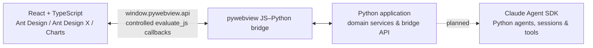

# Xalling

> Your Desktop, Reimagined with AI.

Xalling 是一个本地优先的 AI 桌面工作台：以 Python 管理业务与智能体，以 pywebview 承载 React 界面，并通过安全、直接的 JavaScript–Python 桥接完成交互。它不把本地 HTTP 服务当作前后端中间层。

## 产品方向

界面采用深色、低干扰的桌面工作台风格。参考设计为：左侧常驻导航与项目/任务区，中央保留大面积对话或工作区，输入框位于视觉焦点，快捷任务以轻量卡片呈现。目标是在高信息密度下保持清晰的层级、状态反馈和可操作性。

典型能力包括：

- 新建与管理 AI 任务、项目和会话
- 在统一对话界面中调用本地 Python 能力和智能体
- 将任务进度、统计与趋势以卡片和图表展示
- 为文件、命令等敏感工具调用提供明确的确认与结果反馈

## 架构



所有业务数据都经 pywebview 的 JS–Python 桥传递；Python 服务不监听 localhost 端口，前端也不通过 `fetch`、Axios、WebSocket 或 SSE 调用本地后端。

## 技术栈

| 层级 | 选型 | 用途 |
| --- | --- | --- |
| 桌面容器 | [pywebview](https://pywebview.flowrl.com/) | 原生窗口、加载本地 Web UI、JS–Python 桥 |
| 后端 | Python 3.12 + `uv` | 领域逻辑、文件与系统能力、桥接 API、测试与依赖管理 |
| 基础 UI | [Ant Design](https://ant.design/components/overview-cn/) | 桌面布局、表单、数据展示、导航和反馈组件 |
| AI UI | [Ant Design X](https://x.ant.design/components/introduce-cn/) | 会话、消息气泡、输入、快捷提示、思考/任务状态等 AI 交互组件 |
| 图表 | [Ant Design Charts](https://charts.ant.design/examples/statistics/line/#basic) | 任务趋势、统计和分析视图；连续数据优先使用折线图 |
| 智能体 | [Claude Agent SDK](https://code.claude.com/docs/en/agent-sdk/python) | Python 智能体、会话、工具与任务循环 |
| 配置 | Pydantic Settings + Tomli-W | TOML 配置加载、类型校验与局部更新 |

智能体层规划使用 **Claude Agent SDK for Python**，当前尚未接入执行逻辑。

## 模型配置

本地配置使用 TOML 数组；每个 `[[model]]` 是一级模型站点，每个 `[[model.models]]` 是该站点下的模型配置。`image_vision` 属于具体模型，表示该模型是否支持图片输入；后续可并列增加 `video_vision` 等更细分的能力：

```toml
[[model]]
name = "内部部署 · 阿里云"
api_key = ""
api_url = "https://api.example.com"
[[model.models]]
name = "Kimi-K2.6"
image_vision = true

[[model.models]]
name = "Qwen3.6-35B-A3B"
image_vision = false

[[model]]
name = "RightCode-gemini"
api_key = ""
api_url = "https://api.example.com"
[[model.models]]
name = "gemini-3.1-pro-preview"
image_vision = true
```

`backend/config/setting.py` 中的 `Settings` 会把 `model` 加载为 `ModelSiteConfig` 列表，每个站点下的 `models` 则是 `ModelConfig` 列表。界面通过 pywebview 桥接获取分组名、模型名和能力属性，并保存当前选择，不会接触 API Key 或 API URL。推理强度是对话界面的临时状态，不写入配置文件。

真实配置位于 `~/.xalling/setting.toml`；可从仓库根目录的 `setting.example.toml` 复制创建。示例文件不包含 API Key。

当前选择单独保存在 `~/.xalling/current.toml`：

```toml
[model]
site = "火山方舟"
name = "glm-5.3-flash"
```

`current.toml` 按功能分组，后续当前状态可以增加新的顶级分组。应用启动时会优先恢复 `[model]` 中的选择；文件不存在或所选模型已从 `setting.toml` 移除时，会自动选中并保存第一个可用模型。

## 通信契约

### 前端调用 Python

Python 通过 `js_api` 暴露 API，前端统一从一个桥接模块调用：

```ts
await window.pywebview.api.minimize_window();
```

当前桥接仅负责最小化、最大化/还原和关闭原生窗口，不承载任务提交或智能体逻辑。后续扩展桥接时，调用必须是异步的，参数和返回值只使用可 JSON 序列化的数据。

### Python 推送界面

长任务或智能体流式执行时，Python 使用 `window.evaluate_js(...)` 调用前端预先注册的受控回调。前端将事件归并到状态管理层，再渲染 Ant Design X 的消息、思考链或任务状态。

### 明确禁止

- 不使用 Flask、FastAPI、Django、aiohttp、uvicorn 等方式为 UI 提供业务 HTTP API。
- 不使用 REST、`fetch`、Axios、XHR、WebSocket、SSE 或 localhost 端口在本地前后端间传输业务数据。
- 不将密钥、模型端点或 Python 内部对象传入前端。

### 桥接实现要求

- 前端必须等待 `pywebviewready` 事件后再调用桥接 API。
- Python 通过 `webview.create_window(..., js_api=api)` 暴露职责单一的 API；所有入参须进行类型、长度与权限校验。
- 返回值只使用 JSON 可序列化数据。使用 `evaluate_js` 推送事件时，必须通过受控回调传递已安全编码的数据，避免拼接不受信任的脚本。
- 桥接 API 集中封装在一个前端模块中；业务组件不得散落直接调用 `window.pywebview.api`。

## 项目状态与目录规划

当前仓库已具备 Python 3.12、`uv`、pywebview 及基础窗口骨架。随着界面实现推进，代码按以下边界组织：

```text
main.py                 # 窗口创建和应用生命周期
backend/                # 领域服务、桥接 API、agents/
frontend/               # React + TypeScript 源码
frontend/dist/          # 构建后的本地静态资源
tests/                  # Python 与桥接契约测试
```

前端构建产物由 pywebview 从本地加载；无论开发还是发布，业务交互都保持通过桥接而非 HTTP。

## 实现约定

### 前端

- 优先使用 Ant Design 的 `Layout`、`Menu`、`Card`、`Form`、`Table` 与 `ConfigProvider` 构建可访问、高信息密度的桌面界面。
- AI 对话与任务交互优先使用 Ant Design X 的 `Welcome`、`Conversations`、`Bubble`、`Sender`、`ThoughtChain` 和 `Actions`。
- 图表采用 Ant Design Charts；连续时间趋势优先使用折线图。图表容器必须具有明确宽高，并在页面销毁时释放实例。
- 所有前端代码使用 TypeScript。开发组件前先查询对应版本的官方 API 与示例，不凭记忆猜测属性。

### Python 与智能体

- Python 负责领域服务、桥接 API、智能体运行与敏感能力控制；不得阻塞 pywebview UI 线程。
- 当前阶段不在 pywebview 桥接层实现任务提交或智能体执行。
- 后续智能体采用 Claude Agent SDK Python；代理、会话、工具与任务循环封装在独立 Python 服务层，再由桥接调用稳定的应用接口。
- 文件、命令、MCP 或网络工具需经过单独的权限设计与用户确认后才能启用。
- 工具调用遵循最小权限原则；文件、命令或外部服务操作必须由用户清晰触发，并提供进度、确认和结果反馈。
- 模型端点、密钥和其他敏感配置仅放在环境变量或本地安全配置中，不得进入前端 bundle、源码或日志。

## 快速开始

前置条件：Python 3.12，以及已安装的 [uv](https://docs.astral.sh/uv/)。

```powershell
uv sync
cd frontend
npm install
npm run build
cd ..
uv run python main.py
```

## 开发命令

```powershell
# 静态检查
uv run ruff check .

# 运行测试
uv run pytest

# 检查并构建本地前端资源
cd frontend
npm run check
npm run build
```

修改桥接 API 后，请同时验证：正常调用、非法参数、Python 异常回传，以及长任务状态推送。新增界面时，优先复用 Ant Design 和 Ant Design X 组件，并确保图表容器有明确尺寸。

## 打包与发布（Windows / Linux）

发布采用 [PyInstaller](https://pyinstaller.org/en/stable/usage.html) 打包 Python 与 pywebview，并把 `frontend/dist` 作为应用资源一并带入。入口文件通过 `Path(__file__)` 定位资源，和 PyInstaller 的运行时资源定位方式兼容。

默认使用 `--onedir`：它更便于排查 pywebview、WebView 运行时和静态资源问题。验证稳定后可以将 `--onedir` 改为 `--onefile`；单文件模式会在启动时解压资源，因此启动更慢，且运行时对内置文件的修改不会保留。

> 必须在目标系统或对应 CI Runner 上分别构建 Windows 和 Linux 安装包。PyInstaller 不是跨平台编译器，不能在 Windows 上直接产出可运行的 Linux 包，反之亦然。

### 通用准备

在每个构建平台执行一次：

```powershell
# 项目根目录
uv add --dev pyinstaller

Set-Location frontend
npm ci
npm run build
Set-Location ..
```

`dist/`、`build/`、`*.spec` 是可再生打包产物，不应提交到仓库；相应规则已在 `.gitignore` 中维护。

### Windows

前置条件：Windows 10/11，以及 [Microsoft Edge WebView2 Runtime](https://developer.microsoft.com/microsoft-edge/webview2/)；pywebview 在 Windows 使用 Edge Chromium 时依赖该运行时。

```powershell
uv run pyinstaller --noconfirm --clean --windowed --onedir `
  --name Xalling `
  --add-data "frontend/dist:frontend/dist" `
  main.py

.\dist\Xalling\Xalling.exe
```

将 `dist\Xalling\` 目录整体交付给用户。当前 pywebview 版本可由 PyInstaller 的内置 hook 收集所需组件；若后续引入动态加载的 Python 模块，再按实际缺失信息补充 `--hidden-import`。

### Linux（GTK / Debian、Ubuntu 示例）

Linux 必须选择 GTK 或 Qt 渲染器。首个 Linux 发布版本建议使用 GTK，并在干净的 Debian/Ubuntu 构建机上安装系统依赖：

```bash
sudo apt update
sudo apt install -y python3-gi python3-gi-cairo gir1.2-gtk-3.0 gir1.2-webkit2-4.1

# 在 Linux 构建分支中使用 GTK 额外依赖，然后更新 uv.lock
uv add "pywebview[gtk]>=6.2.1"
uv add --dev pyinstaller

cd frontend
npm ci
npm run build
cd ..

uv run pyinstaller --noconfirm --clean --windowed --onedir \
  --name Xalling \
  --add-data "frontend/dist:frontend/dist" \
  main.py

./dist/Xalling/Xalling
```

发布前请在目标发行版的干净用户环境中启动一次，验证窗口创建、静态资源加载、`window.pywebview.api` 桥接与中文字体显示。若采用 Qt，应改用 `pywebview[qt]` 并在该平台重新构建，不要把 Windows 构建产物复制到 Linux。

pywebview 官方的 [冻结说明](https://pywebview.flowrl.com/guide/freezing) 推荐 Windows / Linux 使用 PyInstaller；其 [Linux 安装指南](https://pywebview.flowrl.com/guide/installation) 列出了 GTK 与 Qt 的运行时要求。

## 后续实施顺序

1. 建立 `frontend/` 的 React + TypeScript 工程，引入 Ant Design、Ant Design X 与 Ant Design Charts。
2. 将当前内联 HTML 替换为本地构建产物，并实现统一的桥接 API 客户端。
3. 在 `backend/` 中建立领域服务和桥接 API；为契约增加测试。
4. 接入 Claude Agent SDK，实现可观察、可取消的智能体任务。
5. 落地任务、项目、会话与趋势图等核心工作台界面。
