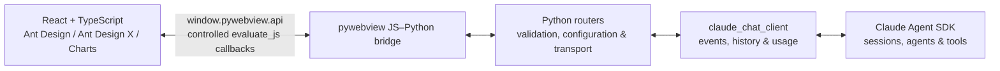

# Xalling

> Your Desktop, Reimagined with AI.

Xalling 是一个本地优先的 AI 桌面工作台：以 Python 管理业务与智能体，以 pywebview 承载 React 界面，并通过安全、直接的 JavaScript–Python 桥接完成交互。它不把本地 HTTP 服务当作前后端中间层。

## 产品方向

界面采用深色、低干扰的桌面工作台风格。参考设计为：左侧常驻导航与项目/任务区，中央保留大面积对话或工作区，输入框位于视觉焦点，快捷任务以轻量卡片呈现。目标是在高信息密度下保持清晰的层级、状态反馈和可操作性。

典型能力包括：

- 新建与管理 AI 任务、项目和会话
- 在统一对话界面中调用本地 Python 能力和智能体
- 将任务进度、统计与趋势以卡片和图表展示
- 为文件、命令等敏感工具调用提供明确的确认与结果反馈

## 架构



所有业务数据都经 pywebview 的 JS–Python 桥传递；Python 服务不监听 localhost 端口，前端也不通过 `fetch`、Axios、WebSocket 或 SSE 调用本地后端。

## 技术栈

| 层级 | 选型 | 用途 |
| --- | --- | --- |
| 桌面容器 | [pywebview](https://pywebview.flowrl.com/) | 原生窗口、加载本地 Web UI、JS–Python 桥 |
| 后端 | Python 3.12 + `uv` | 领域逻辑、文件与系统能力、桥接 API、测试与依赖管理 |
| 基础 UI | [Ant Design](https://ant.design/components/overview-cn/) | 桌面布局、表单、数据展示、导航和反馈组件 |
| AI UI | [Ant Design X](https://x.ant.design/components/introduce-cn/) | 会话、消息气泡、输入、快捷提示、思考/任务状态等 AI 交互组件 |
| 图表 | [Ant Design Charts](https://charts.ant.design/examples/statistics/line/#basic) | 任务趋势、统计和分析视图；连续数据优先使用折线图 |
| 智能体 | [Claude Agent SDK](https://code.claude.com/docs/en/agent-sdk/python) | Python 智能体、会话、工具与任务循环 |
| 配置 | Pydantic Settings + Tomli-W | TOML 配置加载、类型校验与局部更新 |

智能体层已经接入 **Claude Agent SDK for Python**。`backend/claude_chat_client/` 是 SDK 与应用之间的稳定抽象层；路由和前端只依赖它输出的事件、结果与历史快照，不再直接解释 SDK 消息。

## 模型配置

本地配置使用 TOML 数组；每个 `[[model]]` 是一级模型站点，每个 `[[model.models]]` 是该站点下的模型配置。`image_vision` 属于具体模型，表示该模型是否支持图片输入；后续可并列增加 `video_vision` 等更细分的能力：

```toml
[[model]]
name = "内部部署 · 阿里云"
api_key = ""
api_url = "https://api.example.com"
[[model.models]]
name = "Kimi-K2.6"
image_vision = true

[[model.models]]
name = "Qwen3.6-35B-A3B"
image_vision = false

[[model]]
name = "RightCode-gemini"
api_key = ""
api_url = "https://api.example.com"
[[model.models]]
name = "gemini-3.1-pro-preview"
image_vision = true
```

`backend/config/setting.py` 中的 `Settings` 会把 `model` 加载为 `ModelSiteConfig` 列表，每个站点下的 `models` 则是 `ModelConfig` 列表。界面通过 pywebview 桥接获取分组名、模型名和能力属性，并保存当前选择，不会接触 API Key 或 API URL。推理强度是对话界面的临时状态，不写入配置文件。

真实配置位于 `~/.xalling/setting.toml`；可从仓库根目录的 `setting.example.toml` 复制创建。示例文件不包含 API Key。

当前选择单独保存在 `~/.xalling/current.toml`：

```toml
[model]
site = "火山方舟"
name = "glm-5.3-flash"
```

`current.toml` 按功能分组，后续当前状态可以增加新的顶级分组。应用启动时会优先恢复 `[model]` 中的选择；文件不存在或所选模型已从 `setting.toml` 移除时，会自动选中并保存第一个可用模型。

### Skill 目录

Xalling 会把下列已存在的用户级 Skill 目录作为 Claude Agent SDK 本地插件加载：

- Xalling：`~/.xalling/skills/`
- OpenCode：`~/.config/opencode/skills/`
- Agent Skills / Codex：`~/.agents/skills/`
- 当前项目：`<project>/.agents/skills/`

每个 Skill 使用 `<目录>/<skill-name>/SKILL.md` 结构。不存在的目录会被忽略；目录内容的增删会在下一次 Agent 会话启动时重新发现。

## 对话系统

旧的 `backend/chat/` 已完全删除。聊天能力统一由以下几层承担：

| 层级 | 职责 |
| --- | --- |
| `backend/claude_chat_client/` | 管理 Claude SDK 连接，将 SDK 消息转换为稳定事件，处理权限交互、动态工作流、历史回放和单回合用量 |
| `backend/router/_claude_options.py` | 将模型、项目、推理强度、权限模式、Skill 目录和本地运行设置转换成 `ClaudeAgentOptions` |
| `backend/router/chat.py` | 校验界面参数，管理会话级客户端，通过 pywebview 桥发送事件并暴露会话 API |
| `frontend/src/bridge/client.ts` | 定义可 JSON 序列化的桥接契约，订阅 `xalling:chat-event` |
| `Workspace.tsx` / `AgentTrace.tsx` | 用同一个事件归并流程渲染实时对话与历史对话 |

`ClaudeChatClient` 对外提供 `send()`、`stream()`、中断、权限响应、模型/权限模式切换、MCP 状态和后台任务控制等能力。`ClaudeChatHistory` 负责会话列表、历史加载、全文搜索以及将持久化 transcript 恢复成同一套事件。

### 统一事件协议

实时消息和历史记录都使用 `ChatEvent`，前端无需判断数据来自实时流还是历史回放：

```ts
type ChatStreamEvent = {
  id: string;
  event: string;
  turn_id: string;
  session_id: string | null;
  parent_tool_use_id: string | null;
  created_at: string;
  data: Record<string, unknown>;
};
```

- `turn_id` 标识一次用户发起的逻辑回合。
- `parent_tool_use_id` 为空时属于主 Agent；非空时用于把子 Agent 的回复、思考和工具调用嵌入对应的 Agent 工具节点。
- `session_id` 标识 Claude 持久化会话。
- 所有 payload 在进入桥接前都会转换成 JSON 安全值；`ChatEvent` 也支持序列化为 SSE 帧，但桌面应用当前使用 pywebview 事件而不是 HTTP/SSE。

当前事件按职责分为：

- 回合：`turn.started`、`turn.proxy.completed`、`turn.completed`、`turn.failed`
- 用户与代理输入：`user.message`、`user.proxy.message`
- 主 Agent：`assistant.message.*`、`assistant.reply.*`、`assistant.thinking.*`、`assistant.error`
- 工具和交互：`tool.*`、`ask_user.*`、`permission.*`、`plan.approval.*`
- 子 Agent：`subagent.started`、`subagent.user.message`、`subagent.reply.completed`、`subagent.thinking.completed`、`subagent.tool.*`、`subagent.completed`
- 后台任务：`task.started`、`task.progress`、`task.updated`、`task.completed`
- 其他 SDK 状态：`server_tool.*`、`hook.*`、`rate_limit.updated`、`conversation.reset`、`system.*`、`stream.*`、`sdk.unhandled`

未知或暂未专门展示的 SDK 消息不会被静默丢弃，而是降级为 `sdk.unhandled`，便于后续补充适配。

### 正常回合与动态工作流

普通回合的生命周期是：

```text
turn.started
  -> user.message
  -> assistant / tool / subagent events
  -> turn.completed
```

后台子 Agent 形成的动态工作流仍然属于同一个逻辑回合。只要还有后台任务或尚待消费的任务完成通知，主 Agent 的中间 `ResultMessage` 就不会结束回合：

```text
用户请求
  -> 主 Agent 启动 Explore 子 Agent
  -> 主 Agent 中间 ResultMessage
  -> turn.proxy.completed
  -> Explore 完成 / TaskNotificationMessage
  -> user.proxy.message
  -> 主 Agent 继续调用 Plan Agent
  -> Plan 完成并由主 Agent 输出最终结果
  -> turn.completed
```

具体约定如下：

- `TaskStartedMessage`、`TaskProgressMessage` 和非终态 `TaskUpdatedMessage` 会让逻辑回合保持存活。
- `TaskNotificationMessage` 表示后台任务已完成，会驱动原来的 SDK query/event stream 继续处理，而不要求用户再发一条“跑完没”。
- 中间 `ResultMessage` 只产生 `turn.proxy.completed`；所有后台任务链处理完、主 Agent 给出最终结果后才产生唯一的 `turn.completed`。
- Claude Code 注入的 `<task-notification>` 不是人类输入。实时事件和历史回放都把它识别为 `origin.kind = "task-notification"` 的 `user.proxy.message`，不会渲染成用户气泡，也不会错误地开启一个新回合。
- 如果回合被停止或失败，客户端会中断 SDK、拒绝尚未完成的权限请求并发出相应的终态事件，避免留下悬挂状态。

### 用量统计

`turn.completed.data.usage` 和 `ChatResult.usage` 表示“这一次用户提交所触发的逻辑回合”，不是整个会话累计，也不是最后一个 SDK 响应的孤立值。

统计规则：

- 累加本逻辑回合中所有主 Agent `ResultMessage.usage` 的 `input_tokens`、`output_tokens`、`cache_read_input_tokens` 和 `cache_creation_input_tokens`。
- 动态工作流里中间主 Agent 响应和最终主 Agent 响应都会计入。
- 排除 `TaskNotificationMessage.usage`，因此后台 Explore、Plan 等子 Agent 自身消耗不会混进主 Agent 的单条回复用量。
- 排除当前用户请求之前到达的无关代理结果。
- `model` 取本回合主 Agent 的模型；`stop_reason` 和 `terminal_reason` 取最终结果。
- 历史回放会聚合该回合所有顶层 `assistant.message.completed` 的 usage，并排除带 `parent_tool_use_id` 的子 Agent 消息，保持与实时统计一致。

界面只在每条最终 AI 回复下提供“查看响应用量”弹层，不再展示对话框底部的总 token、总耗时、工具次数或缓存命中率汇总。弹层中的“总 Token”是上述四个 token 字段之和。

### 实时与历史的渲染一致性

- 实时事件通过 `window` 上的 `xalling:chat-event` 分发；前端按 `session_id` 过滤订阅。
- 历史消息由 `ClaudeChatHistory` 重新生成 `turn.started`、正文/工具/子 Agent 事件，并补出 transcript 中不存在的 `turn.completed`。
- 子 Agent transcript 会按 `parent_tool_use_id` 插入对应工具节点，支持嵌套子 Agent。
- 当前正在流式输出的主 Agent 正文只在气泡正文显示，不会同时在执行轨迹中重复一份。
- 动态工作流遇到 `turn.proxy.completed` 或 `user.proxy.message` 边界时，上一段主 Agent 中间回复会移入默认折叠的执行轨迹；最后一段主 Agent 回复保留在气泡正文。
- 实时和历史都调用同一个事件归并函数，因此刷新、切换会话后不会改变消息角色、折叠结构或 usage 口径。

### 会话、搜索与客户端生命周期

桥接层当前提供：发送消息、列出会话、搜索会话、读取会话历史、读取正在运行的事件快照、停止生成以及响应权限请求。

- 会话搜索覆盖标题以及可见的用户/主 Agent 文本，返回 `event_id`、`turn_id` 和 `role` 以便界面定位。
- 正在生成的会话会合并进会话列表，并带有 `running` 状态；界面重连时可用 `get_active_chat()` 恢复当前回合事件。
- 同一会话不能并发发送两条消息，不同会话可以分别管理。
- 会话级 SDK 客户端在空闲后保留 5 分钟以便复用；再次使用会取消回收计时。回收客户端只释放运行资源，持久化 transcript 仍由 `ClaudeChatHistory` 加载。
- 应用关闭时会统一关闭仍保留的客户端和临时配置资源。

### 权限与特殊工具

- 普通工具统一产生 `permission.requested` / `permission.resolved`。
- `AskUserQuestion` 会转换成结构化问题、选项和多选信息，由前端对话框收集完整答案后再恢复 SDK 调用。
- `ExitPlanMode` 会产生计划审批事件；批准时可应用 SDK 建议的权限模式，拒绝时可把反馈交回 Agent 继续规划。
- 如果权限事件无法送达前端，后端会自动拒绝该调用，防止 SDK 永久等待。

## 通信契约

### 前端调用 Python

Python 通过 `js_api` 暴露 API，前端统一从一个桥接模块调用：

```ts
await sendChatMessage(prompt, projectPath, sessionId, effort, permissionMode);
```

桥接现已承载窗口控制、模型配置、项目文件、Claude 命令/Skill、消息发送、历史查询、运行中会话恢复、停止生成和权限响应。所有业务组件统一调用 `frontend/src/bridge/client.ts`，不直接访问 `window.pywebview.api`。桥接调用是异步的，参数和返回值只使用可 JSON 序列化的数据。

### Python 推送界面

长任务或智能体流式执行时，Python 使用 `window.evaluate_js(...)` 分发 `xalling:chat-event`。事件内容先通过 `json.dumps` 安全编码，前端再按 `session_id` 订阅并归并成 Ant Design X 消息、思考链、工具调用和子 Agent 轨迹。无法投递的权限请求会由后端自动拒绝。

### 明确禁止

- 不使用 Flask、FastAPI、Django、aiohttp、uvicorn 等方式为 UI 提供业务 HTTP API。
- 不使用 REST、`fetch`、Axios、XHR、WebSocket、SSE 或 localhost 端口在本地前后端间传输业务数据。
- 不将密钥、模型端点或 Python 内部对象传入前端。

### 桥接实现要求

- 前端必须等待 `pywebviewready` 事件后再调用桥接 API。
- Python 通过 `webview.create_window(..., js_api=api)` 暴露职责单一的 API；所有入参须进行类型、长度与权限校验。
- 返回值只使用 JSON 可序列化数据。使用 `evaluate_js` 推送事件时，必须通过受控回调传递已安全编码的数据，避免拼接不受信任的脚本。
- 桥接 API 集中封装在一个前端模块中；业务组件不得散落直接调用 `window.pywebview.api`。

## 项目状态与目录

当前仓库已经具备完整的本地桌面窗口、模型配置、Claude 对话、事件流、权限交互、会话历史与搜索能力。代码按以下边界组织：

```text
main.py                            # 窗口创建和应用生命周期
backend/claude_chat_client/        # Claude SDK 稳定抽象、事件、历史和用量
backend/router/                    # pywebview API、输入校验和应用配置适配
backend/config/                    # 模型站点和当前选择
frontend/src/bridge/client.ts      # 前端桥接契约
frontend/src/components/           # 对话工作区、执行轨迹和权限对话框
frontend/dist/                     # 构建后的本地静态资源
tests/                             # 客户端、历史、路由和桥接契约测试
```

前端构建产物由 pywebview 从本地加载；无论开发还是发布，业务交互都保持通过桥接而非 HTTP。

## 实现约定

### 前端

- 优先使用 Ant Design 的 `Layout`、`Menu`、`Card`、`Form`、`Table` 与 `ConfigProvider` 构建可访问、高信息密度的桌面界面。
- AI 对话与任务交互优先使用 Ant Design X 的 `Welcome`、`Conversations`、`Bubble`、`Sender`、`ThoughtChain` 和 `Actions`。
- 图表采用 Ant Design Charts；连续时间趋势优先使用折线图。图表容器必须具有明确宽高，并在页面销毁时释放实例。
- 所有前端代码使用 TypeScript。开发组件前先查询对应版本的官方 API 与示例，不凭记忆猜测属性。

### Python 与智能体

- Python 负责领域服务、桥接 API、智能体运行与敏感能力控制；不得阻塞 pywebview UI 线程。
- Claude Agent SDK 的代理、会话、工具与任务循环封装在 `backend/claude_chat_client/`；路由只负责应用输入、配置和传输。
- 实时与历史必须输出同一套 `ChatEvent`，新增 SDK 消息类型时先在适配层定义语义，再由界面消费，禁止前端直接依赖 SDK 原始对象。
- 文件、命令、MCP 或网络工具必须经过权限模式或显式用户确认；`AskUserQuestion` 和计划审批使用专门的结构化交互。
- 工具调用遵循最小权限原则；文件、命令或外部服务操作必须由用户清晰触发，并提供进度、确认和结果反馈。
- 模型端点、密钥和其他敏感配置仅放在环境变量或本地安全配置中，不得进入前端 bundle、源码或日志。

## 快速开始

前置条件：Python 3.12，以及已安装的 [uv](https://docs.astral.sh/uv/)。

```powershell
uv sync
cd frontend
npm install
npm run build
cd ..
uv run python main.py
```

## 开发命令

```powershell
# 静态检查
uv run ruff check .

# 运行测试
uv run pytest

# 检查并构建本地前端资源
cd frontend
npm run check
npm run build
```

修改桥接 API 后，请同时验证：正常调用、非法参数、Python 异常回传，以及长任务状态推送。新增界面时，优先复用 Ant Design 和 Ant Design X 组件，并确保图表容器有明确尺寸。

## 打包与发布（Windows / Linux）

发布采用 [PyInstaller](https://pyinstaller.org/en/stable/usage.html) 打包 Python 与 pywebview，并把 `frontend/dist` 作为应用资源一并带入。入口文件通过 `Path(__file__)` 定位资源，和 PyInstaller 的运行时资源定位方式兼容。

默认使用 `--onedir`：它更便于排查 pywebview、WebView 运行时和静态资源问题。验证稳定后可以将 `--onedir` 改为 `--onefile`；单文件模式会在启动时解压资源，因此启动更慢，且运行时对内置文件的修改不会保留。

> 必须在目标系统或对应 CI Runner 上分别构建 Windows 和 Linux 安装包。PyInstaller 不是跨平台编译器，不能在 Windows 上直接产出可运行的 Linux 包，反之亦然。

### 通用准备

在每个构建平台执行一次：

```powershell
# 项目根目录
uv add --dev pyinstaller

Set-Location frontend
npm ci
npm run build
Set-Location ..
```

`dist/`、`build/`、`*.spec` 是可再生打包产物，不应提交到仓库；相应规则已在 `.gitignore` 中维护。

### Windows

前置条件：Windows 10/11，以及 [Microsoft Edge WebView2 Runtime](https://developer.microsoft.com/microsoft-edge/webview2/)；pywebview 在 Windows 使用 Edge Chromium 时依赖该运行时。

```powershell
uv run pyinstaller --noconfirm --clean --windowed --onedir `
  --name Xalling `
  --add-data "frontend/dist:frontend/dist" `
  main.py

.\dist\Xalling\Xalling.exe
```

将 `dist\Xalling\` 目录整体交付给用户。当前 pywebview 版本可由 PyInstaller 的内置 hook 收集所需组件；若后续引入动态加载的 Python 模块，再按实际缺失信息补充 `--hidden-import`。

### Linux（GTK / Debian、Ubuntu 示例）

Linux 必须选择 GTK 或 Qt 渲染器。首个 Linux 发布版本建议使用 GTK，并在干净的 Debian/Ubuntu 构建机上安装系统依赖：

```bash
sudo apt update
sudo apt install -y python3-gi python3-gi-cairo gir1.2-gtk-3.0 gir1.2-webkit2-4.1

# 在 Linux 构建分支中使用 GTK 额外依赖，然后更新 uv.lock
uv add "pywebview[gtk]>=6.2.1"
uv add --dev pyinstaller

cd frontend
npm ci
npm run build
cd ..

uv run pyinstaller --noconfirm --clean --windowed --onedir \
  --name Xalling \
  --add-data "frontend/dist:frontend/dist" \
  main.py

./dist/Xalling/Xalling
```

发布前请在目标发行版的干净用户环境中启动一次，验证窗口创建、静态资源加载、`window.pywebview.api` 桥接与中文字体显示。若采用 Qt，应改用 `pywebview[qt]` 并在该平台重新构建，不要把 Windows 构建产物复制到 Linux。

pywebview 官方的 [冻结说明](https://pywebview.flowrl.com/guide/freezing) 推荐 Windows / Linux 使用 PyInstaller；其 [Linux 安装指南](https://pywebview.flowrl.com/guide/installation) 列出了 GTK 与 Qt 的运行时要求。

## 继续开发时的检查清单

1. 新增 Claude SDK 消息类型时，同时更新 `models.py`、`message_adapter.py`、历史装配测试和前端事件归并。
2. 改动逻辑回合结束条件时，覆盖普通回复、异步子 Agent、多个连续后台任务、用户停止和异常中断。
3. 改动 usage 时，分别验证实时与历史，并明确主 Agent、子 Agent 和任务通知的统计边界。
4. 改动桥接 API 时，同步更新 Python 路由、`frontend/src/bridge/client.ts` 类型以及非法参数/异常回传测试。
5. 发布前运行 Python 静态检查和完整测试，并执行前端类型检查与生产构建。
