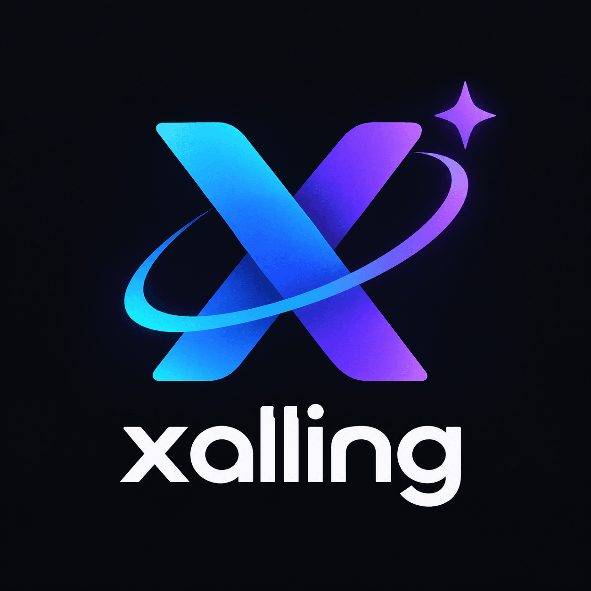
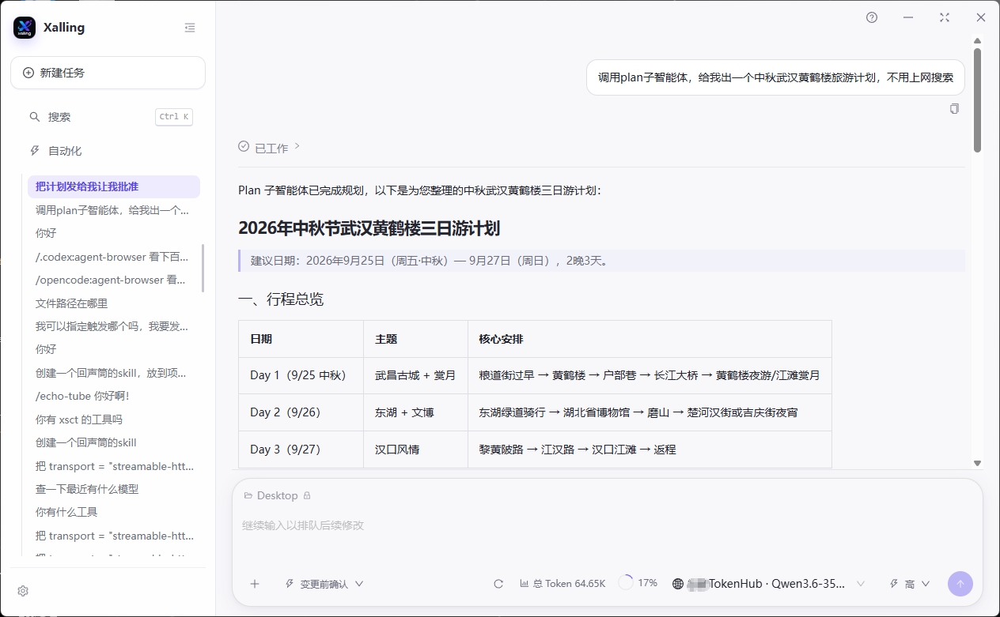
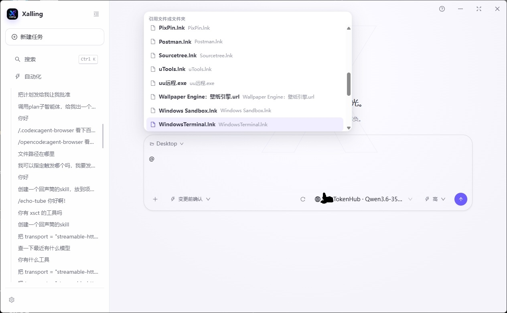
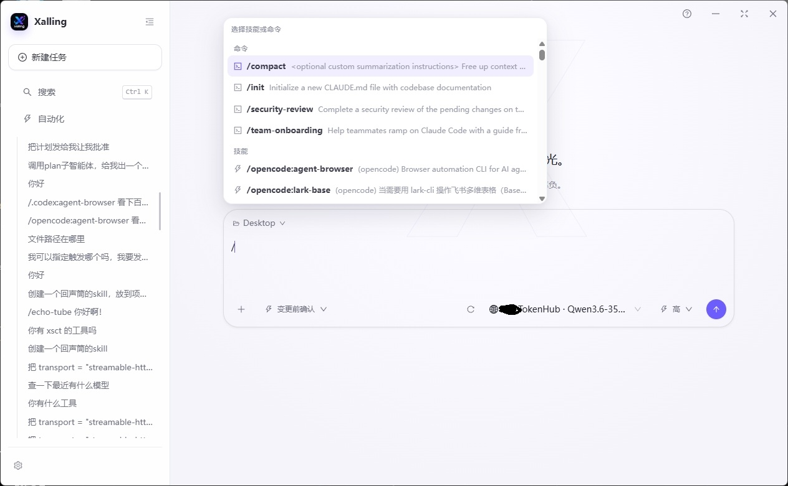
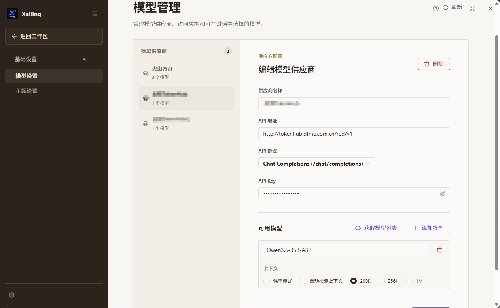
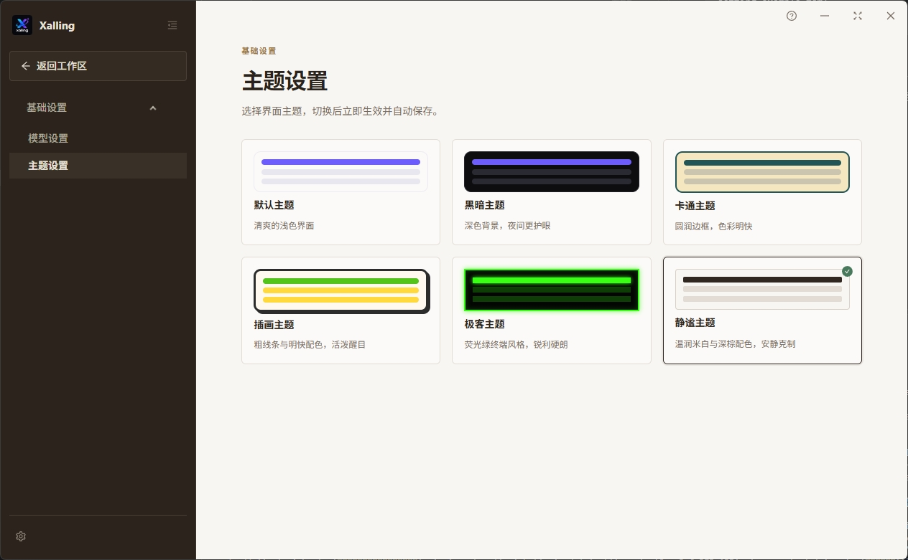
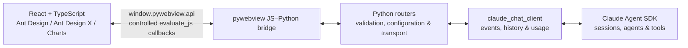

<div align="center">



# Xalling

**Your Desktop, Reimagined with AI.**

本地优先的 AI 桌面工作台

</div>

---

## 简介

Xalling 是一个运行在桌面上的 AI 工作台：后端用 Python 管理领域逻辑与 Claude Agent SDK 智能体，前端用 React + Ant Design 构建界面，两者通过 pywebview 的 JS–Python 桥直接通信。

## 功能特性

- **AI 对话工作区**：基于 [Claude Agent SDK](https://code.claude.com/docs/en/agent-sdk/python) 的多会话对话，支持子 Agent、后台任务与动态工作流
- **统一事件协议**：实时流式输出与历史回放共用同一套事件归并逻辑，刷新或切换会话后结构不漂移
- **权限与交互**：工具调用确认、`AskUserQuestion` 结构化问答、计划审批（ExitPlanMode）
- **斜杠命令与 Skill**：输入框 `/` 唤起命令与技能列表，自动发现用户级与项目级 Skill 目录
- **定时自动化**：基于 APScheduler 的定时任务（interval / date / cron），任务持久化在 SQLite
- **模型站点管理**：多供应商模型配置，支持 `anthropic` / `chat` / `responses` 三种 API 协议
- **用量统计**：按逻辑回合统计主 Agent Token 与子 Agent 消耗，提供会话内用量弹层
- **会话历史与搜索**：会话列表、全文搜索、运行中会话恢复
- **多主题外观**：default / dark / cartoon / illustration / geek / serene 六套主题
- **本地教程**：内置命令说明等教程文档，在应用内直接查看

## 界面预览

| 对话工作区 | 斜杠命令与技能 |
| :-: | :-: |
|  |  |

| `@` 引用文件 | 模型管理 |
| :-: | :-: |
|  |  |

| 主题设置 |
| :-: |
|  |

## 架构



所有业务数据都经 pywebview 的 JS–Python 桥传递；Python 服务不监听 localhost 端口，前端也不通过 `fetch`、Axios、WebSocket 或 SSE 调用本地后端。详细通信契约与事件协议见 [AGENTS.md](AGENTS.md)。

## 技术栈

| 层级 | 选型 | 用途 |
| --- | --- | --- |
| 桌面容器 | [pywebview](https://pywebview.flowrl.com/) | 原生无边框窗口、加载本地 Web UI、JS–Python 桥 |
| 后端 | Python 3.12 + [uv](https://docs.astral.sh/uv/) | 领域逻辑、文件与系统能力、桥接 API、测试与依赖管理 |
| 基础 UI | [Ant Design](https://ant.design/components/overview-cn/) | 桌面布局、表单、数据展示、导航和反馈组件 |
| AI UI | [Ant Design X](https://x.ant.design/components/introduce-cn/) | 会话、消息气泡、输入、快捷提示、思考/任务状态等 AI 交互组件 |
| 图表 | [Ant Design Charts](https://charts.ant.design/) | 任务趋势、统计和分析视图 |
| 智能体 | [Claude Agent SDK](https://code.claude.com/docs/en/agent-sdk/python) | Python 智能体、会话、工具与任务循环 |
| 定时任务 | APScheduler + SQLAlchemy JobStore | 定时/周期任务调度与持久化 |
| 配置 | Pydantic Settings + Tomli-W | TOML 配置加载、类型校验与局部更新 |
| 打包 | PyInstaller + Inno Setup | Windows 目录分发与安装程序 |

## 快速开始

前置条件：Python 3.12、[uv](https://docs.astral.sh/uv/)、Node.js。

```powershell
# 1. 安装依赖并构建前端
uv sync
cd frontend
npm install
npm run build
cd ..

# 2. 配置模型（见下节）
# 将 setting.example.toml 复制为 ~/.xalling/xalling-setting.toml 并填入模型站点信息

# 3. 启动
uv run python main.py
```

## 模型配置

本地配置使用 TOML 数组；每个 `[[model]]` 是一级模型站点，每个 `[[model.models]]` 是该站点下的模型：

```toml
[[model]]
name = "内部部署 · 阿里云"
api_key = ""
api_url = "https://api.example.com"
# 可选值：anthropic、chat、responses；后两者会通过本地代理转换为 Anthropic Messages
api_protocol = "anthropic"

[[model.models]]
name = "Kimi-K2.6"

[[model.models]]
name = "Qwen3.6-35B-A3B"
```

- `api_protocol = "anthropic"`：供应商原生支持 Anthropic Messages 协议，直接连接。
- `api_protocol = "chat"` / `"responses"`：为每个 Claude 会话启动一个仅监听 `127.0.0.1` 的本地代理（[`plugins/claude-proxy-rust`](https://github.com/luojiaaoo/claude-proxy-rust)），把 Anthropic Messages 请求转换为 OpenAI Chat Completions / Responses 接口，连接关闭后自动回收。

真实配置位于 `~/.xalling/xalling-setting.toml`（可从仓库根目录的 [setting.example.toml](setting.example.toml) 复制创建，示例文件不含 API Key）。当前选择的模型单独保存在 `~/.xalling/xalling-current.toml`。

### Skill 目录

Xalling 会把下列已存在的用户级 Skill 目录作为 Claude Agent SDK 本地插件加载：

- Xalling：`~/.xalling/skills/`
- OpenCode：`~/.config/opencode/skills/`
- Agent Skills / Codex：`~/.agents/skills/`
- 当前项目：`<project>/.agents/skills/`

每个 Skill 使用 `<目录>/<skill-name>/SKILL.md` 结构，不存在的目录会被忽略。

## 开发

```powershell
# Python 静态检查与测试
uv run ruff check .
uv run pytest

# 前端类型检查与生产构建
cd frontend
npm run check
npm run build
```

## 打包与发布（Windows）

前置条件：Windows 10/11、[Microsoft Edge WebView2 Runtime](https://developer.microsoft.com/microsoft-edge/webview2/)、[Rust 工具链](https://www.rust-lang.org/tools/install)、[Inno Setup 6](https://jrsoftware.org/isinfo.php)。

```powershell
git submodule update --init --recursive
.\script\package_windows.bat
```

脚本会依次执行：构建 `claude-proxy-rust` → 构建前端 → PyInstaller 打包 → Inno Setup 生成安装程序。产物位于 `dist\`：

- `dist\Xalling\`：绿色目录版，可直接运行 `Xalling.exe`
- `dist\Xalling-Setup-<版本>.exe`：安装程序（传 `onefile` 参数可跳过安装包步骤）

版本号由 `script\installer_windows.iss` 的 `MyAppVersion` 维护，需与 `pyproject.toml` 保持一致。Linux 构建方式见 [AGENTS.md](AGENTS.md)。

> PyInstaller 不是跨平台编译器，必须在目标系统上分别构建。

## 项目结构

```text
main.py                            # 窗口创建和应用生命周期
backend/
  claude_chat_client/              # Claude SDK 稳定抽象、事件、历史和用量
  router/                          # pywebview API 与输入校验
  service/                         # 领域服务实现
  config/                          # 模型站点和当前选择
frontend/
  src/bridge/client.ts             # 前端桥接契约
  src/components/                  # 对话工作区、执行轨迹、权限对话框、设置等
plugins/
  claude-proxy-rust/               # OpenAI 兼容代理（Git 子模块）
script/
  package_windows.bat              # 一键打包
  installer_windows.iss            # Inno Setup 6 安装程序脚本
screenshot/                        # README 界面截图
tutorials/                         # 应用内教程文档
tests/                             # 客户端、历史、路由和桥接契约测试
setting.example.toml               # 模型配置示例（不含 API Key）
Xalling.spec                       # PyInstaller 打包规格
```

## 深入阅读

对话事件协议、动态工作流、用量统计、通信契约与实现约定等详细文档见 [AGENTS.md](AGENTS.md)。
